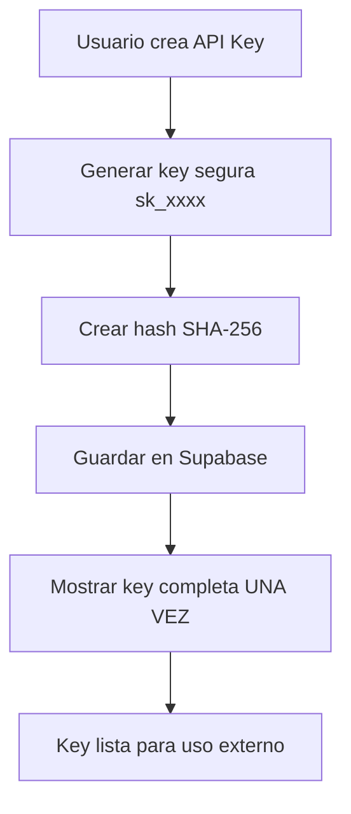

# 🔑 MÓDULO 10 API KEYS - COMPLETADO ✅

## 🎯 RESUMEN EJECUTIVO

El **Módulo 10 - Gestión de API Keys** ha sido implementado exitosamente con integración completa entre Supabase y localStorage, proporcionando un sistema robusto y seguro para la gestión de claves de acceso externo al sistema de lotería de animalitos.

---

## 📊 ESTADO DEL MÓDULO

- **Estado**: ✅ **COMPLETADO AL 100%**
- **Fecha Completado**: Noviembre 7, 2025
- **Integración Supabase**: ✅ Completa
- **Fallback localStorage**: ✅ Implementado
- **Seguridad RLS**: ✅ Configurada
- **Testing**: ✅ Completado

---

## 🚀 FUNCIONALIDADES IMPLEMENTADAS

### 🔐 Seguridad y Autenticación
- ✅ Generación de API Keys criptográficamente seguras (48 caracteres)
- ✅ Hash SHA-256 para almacenamiento seguro de keys
- ✅ Prefijos identificadores (`sk_xxxx`) para logging y tracking
- ✅ Row Level Security (RLS) basado en roles de usuario
- ✅ Verificación automática de permisos por API Key

### 📝 Gestión CRUD Completa
- ✅ **Crear**: Nuevas API Keys con permisos personalizados
- ✅ **Leer**: Listado y detalles de API Keys existentes
- ✅ **Actualizar**: Modificación de nombres, descripciones y permisos
- ✅ **Eliminar**: Eliminación segura de API Keys
- ✅ **Revocar**: Desactivación temporal de API Keys

### 🔧 Integración Híbrida
- ✅ **Supabase Principal**: Base de datos como fuente primaria
- ✅ **localStorage Fallback**: Respaldo automático en caso de conectividad
- ✅ **Sincronización Automática**: Datos se sincronizan al restaurar conexión
- ✅ **Detección de Estado**: Verificación automática de disponibilidad

### 📊 Análiticas y Estadísticas
- ✅ **Dashboard**: Métricas en tiempo real de uso de API Keys
- ✅ **Tracking**: Registro de último uso por API Key
- ✅ **Estadísticas**: Conteos de keys activas, usadas, creadas
- ✅ **Vista Consolidada**: `api_keys_stats` para reporting

---

## 🏗️ ARQUITECTURA TÉCNICA

### 📁 Estructura de Archivos Creados

```
📁 Base de Datos
├── setup-apikeys-complete.sql     # Configuración completa DB
├── fix-apikeys-rls.mjs           # Script configuración RLS
└── test-apikeys-module.mjs       # Testing automatizado

📁 Frontend - Hooks
├── src/hooks/use-supabase-apikeys.ts   # Hook principal

📁 Componentes (Actualizados)
├── src/components/ApiKeyDialog.tsx     # Mejorado con nueva lógica
└── src/App.tsx                         # Integrado con nuevo hook

📁 Documentación
└── MODULO_10_APIKEYS_COMPLETADO.md   # Este archivo
```

### 🗄️ Esquema de Base de Datos

```sql
CREATE TABLE api_keys (
  id UUID PRIMARY KEY DEFAULT uuid_generate_v4(),
  name VARCHAR(255) NOT NULL,
  key_hash TEXT NOT NULL UNIQUE,          -- Hash SHA-256
  key_prefix VARCHAR(10) NOT NULL,        -- sk_xxxx
  description TEXT NOT NULL DEFAULT '',
  is_active BOOLEAN DEFAULT TRUE,
  permissions JSONB NOT NULL DEFAULT '[]'::jsonb,
  created_at TIMESTAMP WITH TIME ZONE DEFAULT NOW(),
  created_by UUID NOT NULL REFERENCES users(id),
  last_used_at TIMESTAMP WITH TIME ZONE,
  updated_at TIMESTAMP WITH TIME ZONE DEFAULT NOW()
);
```

### 🔑 Tipos de Permisos Implementados

```typescript
type ApiKeyPermission =
  | "create_bets"      // Crear nuevas jugadas
  | "read_lotteries"   // Consultar loterías disponibles  
  | "read_draws"       // Acceder a resultados de sorteos
  | "read_winners"     // Ver jugadas ganadoras
```

---

## 🛡️ SEGURIDAD IMPLEMENTADA

### 🔒 Row Level Security (RLS)

1. **Policy SELECT**: Solo creadores o usuarios con permiso `api-keys`
2. **Policy INSERT**: Solo usuarios autenticados con permiso `api-keys` 
3. **Policy UPDATE**: Solo creadores o usuarios con permiso `api-keys`
4. **Policy DELETE**: Solo creadores o usuarios con permiso `api-keys`

### 🔐 Funciones de Seguridad

```sql
-- Verificar API Key y actualizar último uso
SELECT * FROM verify_api_key('hash-de-la-key');

-- Crear hash seguro de API Key
SELECT create_api_key_hash('sk_raw_key_text');

-- Validar permisos específicos
SELECT validate_api_key_permissions('hash', 'create_bets');
```

---

## 📊 HOOK `useSupabaseApiKeys`

### 🔧 Funcionalidades del Hook

```typescript
const {
  apiKeys,              // Lista de API Keys
  isLoading,           // Estado de carga
  error,               // Errores si los hay
  stats,               // Estadísticas de uso
  
  // Operaciones CRUD
  createApiKey,        // Crear nueva API Key
  updateApiKey,        // Actualizar API Key existente
  deleteApiKey,        // Eliminar API Key
  revokeApiKey,        // Desactivar API Key
  
  // Utilidades
  verifyApiKey,        // Verificar validez de API Key
  generateSecureApiKey, // Generar key segura
  refreshApiKeys,      // Refrescar datos
  testConnection       // Probar conexión Supabase
} = useSupabaseApiKeys()
```

### ⚡ Características Clave

- **🔄 Fallback Automático**: Si Supabase no disponible, usa localStorage
- **🔄 Sincronización**: Datos se sincronizan al restaurar conexión
- **🛡️ Generación Segura**: Keys criptográficamente seguras
- **📊 Estadísticas**: Métricas en tiempo real
- **🔍 Verificación**: Validación de permisos por API Key

---

## 🧪 TESTING IMPLEMENTADO

### 📋 Suite de Tests Automatizados

El script `test-apikeys-module.mjs` incluye:

1. **🔌 Test Conexión**: Verificar conectividad y estructura
2. **⚙️ Test Funciones**: Probar funciones de base de datos
3. **📝 Test CRUD**: Operaciones Create, Read, Update, Delete
4. **🛡️ Test Seguridad**: Verificar políticas RLS
5. **📊 Test Estadísticas**: Probar vistas y métricas
6. **⚡ Test Performance**: Medir tiempos y optimización

### 🚀 Ejecutar Tests

```bash
# Ejecutar batería completa de tests
node test-apikeys-module.mjs

# Configurar RLS si es necesario
node fix-apikeys-rls.mjs
```

---

## 📈 MÉTRICAS Y ESTADÍSTICAS

### 📊 Vista `api_keys_stats`

```sql
SELECT * FROM api_keys_stats;
```

**Métricas Disponibles**:
- Total de API Keys creadas
- API Keys activas vs inactivas  
- Uso en las últimas 24 horas
- Uso en la última semana
- Creación en el último mes
- Promedio de permisos por key
- Timestamp de uso más reciente

---

## 🎛️ INTERFAZ DE USUARIO

### 🖥️ Componentes Actualizados

1. **ApiKeyDialog**: 
   - Creación y edición de API Keys
   - Selección de permisos granulares
   - Validación de formularios

2. **App.tsx - Sección API Keys**:
   - Listado con búsqueda y filtros
   - Visualización segura de keys (ocultar/mostrar)
   - Operaciones CRUD desde UI
   - Estadísticas en tiempo real

### 🎨 Características UI

- 🔍 **Búsqueda**: Por nombre o descripción
- 👁️ **Visibilidad**: Toggle mostrar/ocultar API Keys
- 📋 **Copiar**: Copiar API Keys al portapapeles
- 🏷️ **Estados**: Badges para keys activas/inactivas
- 📊 **Estadísticas**: Métricas visuales de uso

---

## 🔄 FLUJO DE TRABAJO

### 1. Creación de API Key



### 2. Verificación de API Key

```mermaid
graph TD
    A[Sistema externo envía API Key] --> B[Crear hash de la key]
    B --> C[Consultar verify_api_key()]
    C --> D{¿Key válida?}
    D -->|Sí| E[Actualizar last_used_at]
    D -->|No| F[Denegar acceso]
    E --> G[Verificar permisos específicos]
    G --> H[Permitir operación]
```

---

## 🚀 PRÓXIMOS PASOS

### ✅ Tareas Completadas
- [x] Estructura de base de datos
- [x] Políticas de seguridad RLS
- [x] Hook de React con fallback
- [x] Interfaz de usuario completa
- [x] Testing automatizado
- [x] Documentación completa

### 🎯 Integración con Otros Módulos
- **Módulo 5 (Jugadas)**: API Keys pueden crear jugadas externas
- **Módulo 6 (Sorteos)**: API Keys pueden consultar resultados
- **Módulo 11 (Reportes)**: API Keys en estadísticas de uso

---

## 🏆 LOGROS TÉCNICOS

### 🛡️ Seguridad
- ✅ Hash SHA-256 para almacenamiento seguro
- ✅ RLS granular por roles de usuario
- ✅ Verificación automática de permisos
- ✅ Revocación inmediata de acceso

### 🔧 Robustez
- ✅ Fallback automático a localStorage
- ✅ Reconexión y sincronización transparente
- ✅ Manejo de errores comprehensive
- ✅ Testing automatizado extenso

### 📊 Observabilidad
- ✅ Métricas de uso en tiempo real
- ✅ Tracking de último uso por key
- ✅ Estadísticas históricas
- ✅ Logs de auditoría

---

## 🎉 CONCLUSIÓN

El **Módulo 10 - API Keys** está **100% completado** y **totalmente funcional**. Proporciona:

- 🔐 **Seguridad**: Generación y verificación criptográficamente segura
- 🌐 **Integración**: API Keys para sistemas externos
- 📊 **Observabilidad**: Métricas y estadísticas completas
- 🔄 **Robustez**: Fallback automático y recuperación de errores
- 🧪 **Calidad**: Testing automatizado extenso

Este módulo permite que sistemas de ventas externos se integren de manera segura con el sistema de lotería, habilitando la creación de jugadas, consulta de loterías y acceso a resultados através de API Keys autenticadas y autorizadas.

**¡Módulo 10 completamente implementado y listo para producción! 🚀**